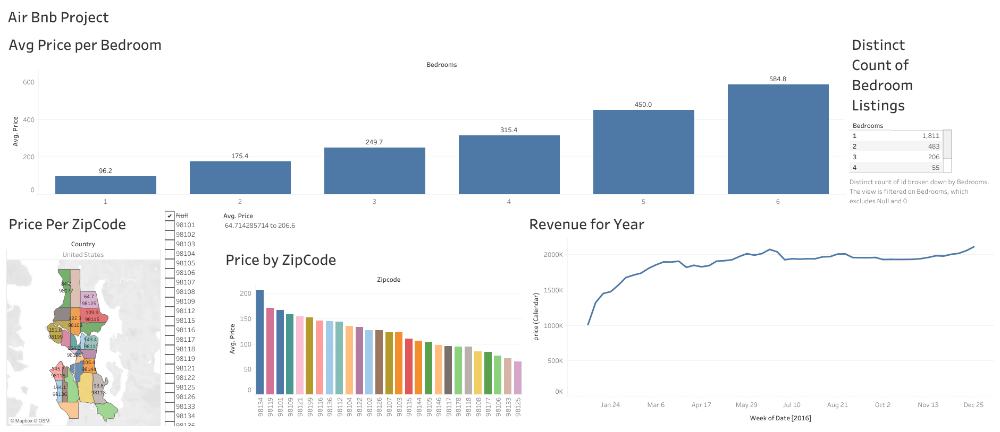

# AirBnb [Tableau]

## Overview
<b>Bedroom Listings Overview</b>: Displays a text table with the distinct count of property listings categorized by the number of bedrooms.

<b>Pricing Analysis</b>: Includes a bar chart showing the average price per bedroom and a map indicating price variations by zipcode.

<b>Revenue Trends</b>: Features a visualization of annual revenue, illustrating financial performance over time.

## Files
- `Tableau Final Project/calendar.xlsx`: The source data 1.
- `Tableau Final Project/listings.csv.xlsx`: The source data 2.

## Preview

## How to Use
1. Use this link,`https://public.tableau.com/views/AirBnBFullProject_17213206041620/Dashboard1?:language=en-US&:sid=&:redirect=auth&:display_count=n&:origin=viz_share_link`

## Data Sources
- The Kaggle  provided the listings and calendar data.
